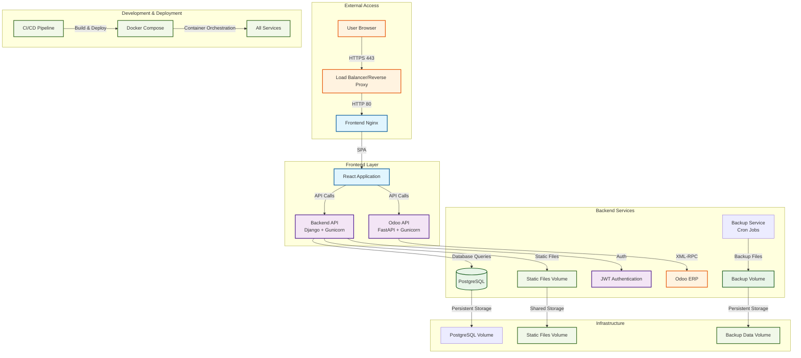

# Certificate Project Architecture

## System Overview

This document describes the architecture of the Certificate Management System for Gulfsat Madagascar and Blueline.

## Architecture Diagram

## Component Details

### Frontend Layer
- **React Application**: Modern React 19 SPA with Vite 5 bundler
- **Nginx**: Reverse proxy and static file server
- **Mantine UI**: Component library for consistent UI
- **TailwindCSS**: Utility-first CSS framework

### Backend Services
- **Django API**: RESTful API with Django REST Framework
- **FastAPI Odoo Connector**: XML-RPC bridge to Odoo ERP
- **Gunicorn**: WSGI server for Python applications
- **PostgreSQL**: Primary database for application data

### Infrastructure
- **Docker Compose**: Container orchestration
- **Volumes**: Persistent storage for database, static files, and backups
- **Health Checks**: Service monitoring and auto-recovery
- **Environment Variables**: Configuration management

## Data Flow

1. **User Authentication**: JWT-based authentication through Django
2. **Employee Data**: Synced from Odoo ERP via FastAPI connector
3. **Document Generation**: PDF generation for certificates and attestations
4. **Backup System**: Automated database backups every 10 minutes

## Security Features
- JWT token authentication with expiration
- CORS configuration for cross-origin requests
- Database connection security
- Environment variable management
- Container isolation