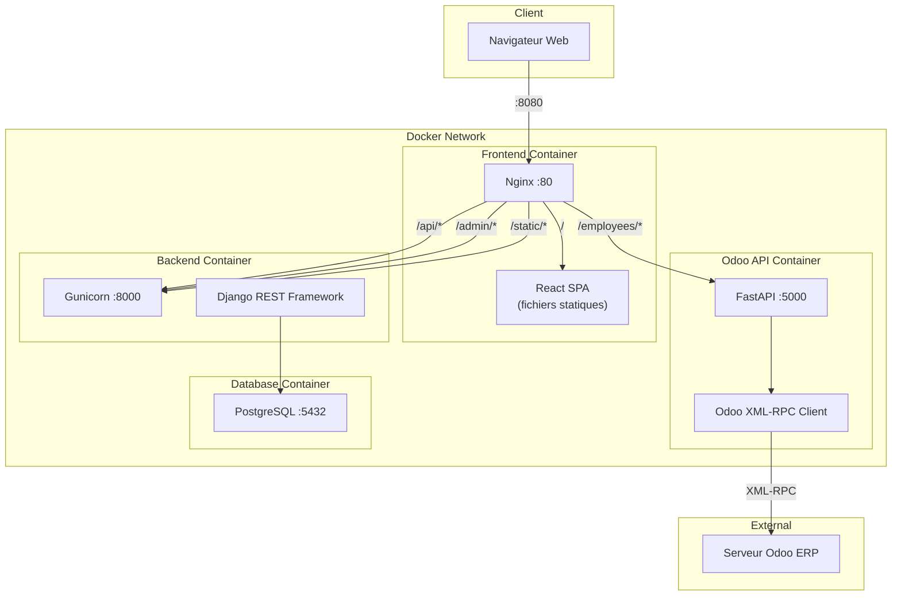
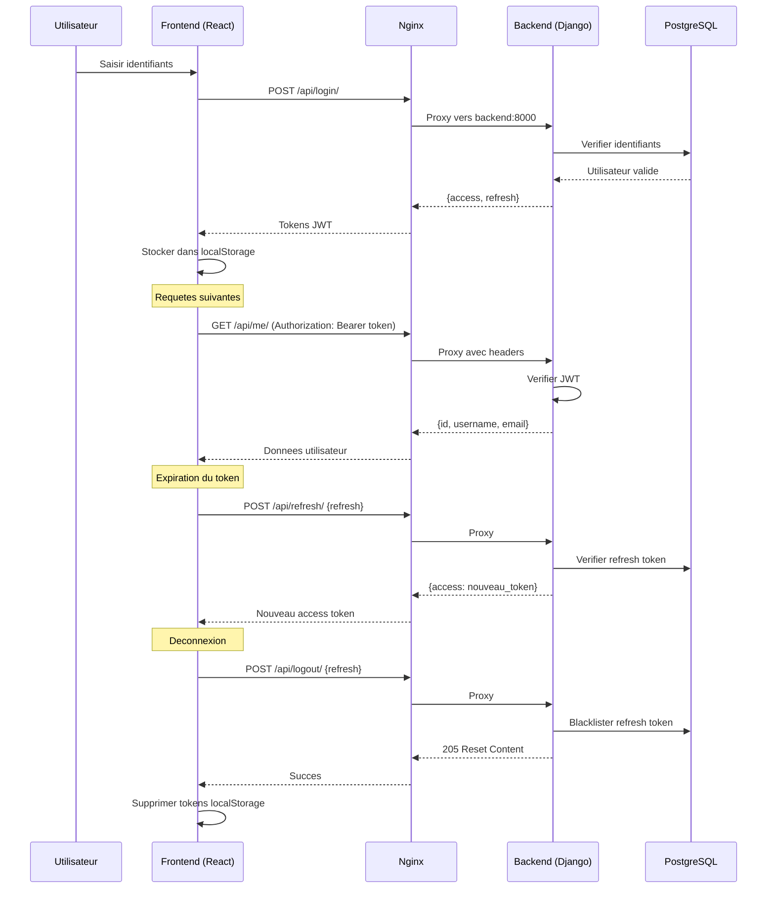
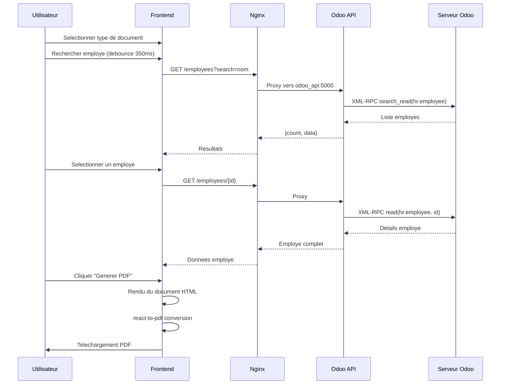
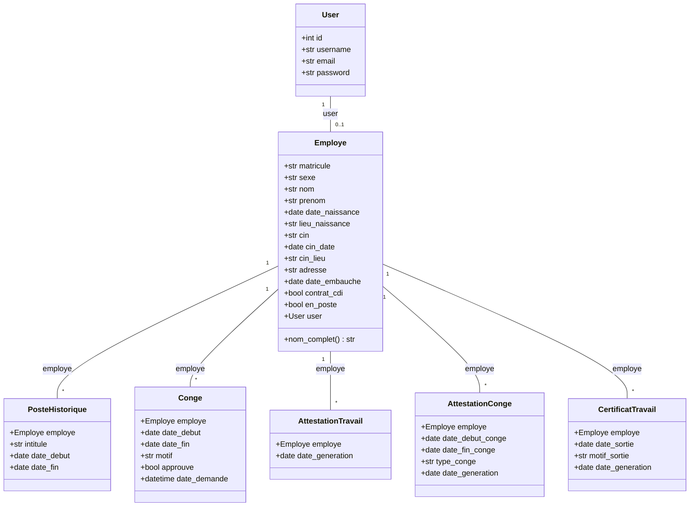
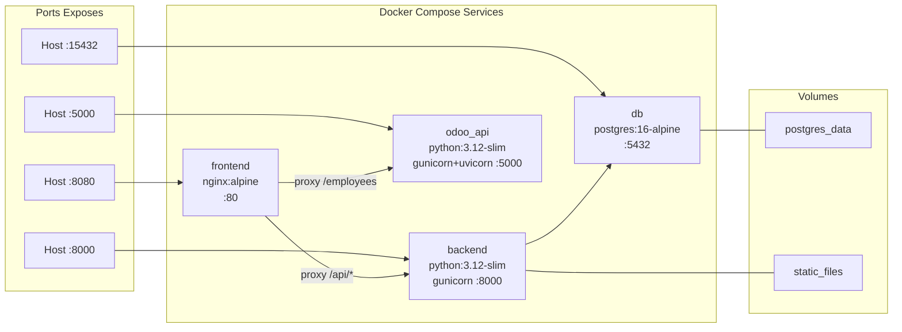
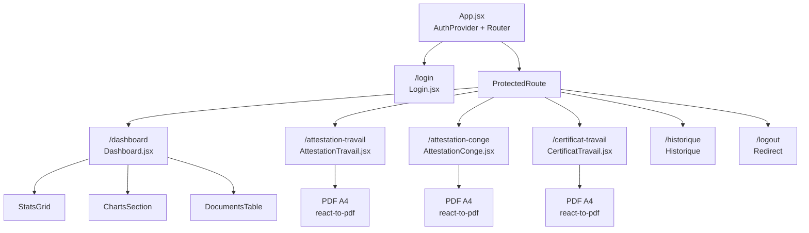
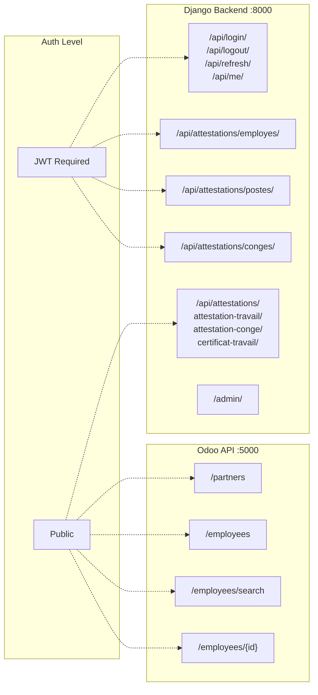

# Architecture du Projet

## Diagramme d'Architecture Globale

## Diagramme de Flux d'Authentification

## Diagramme de Generation de Document

## Diagramme de Classes (Modeles Django)

## Diagramme d'Infrastructure Docker

## Diagramme des Routes Frontend

## Diagramme des Endpoints API

