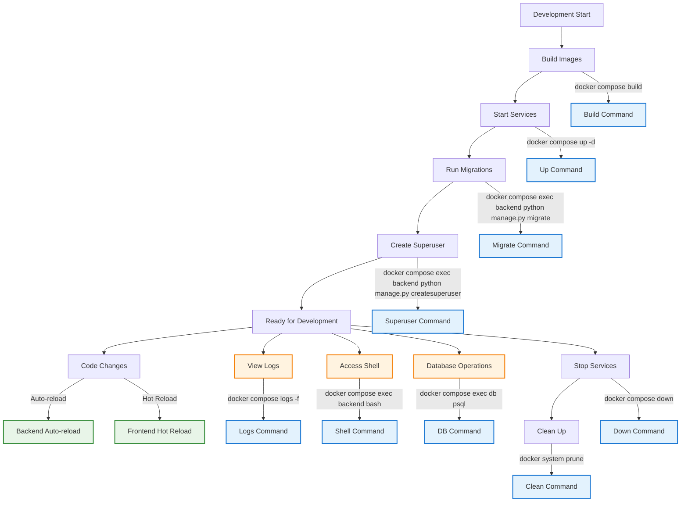
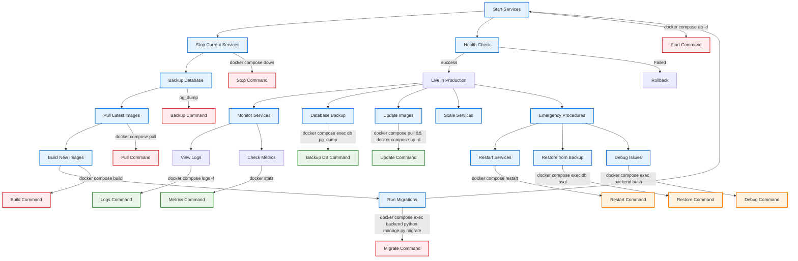
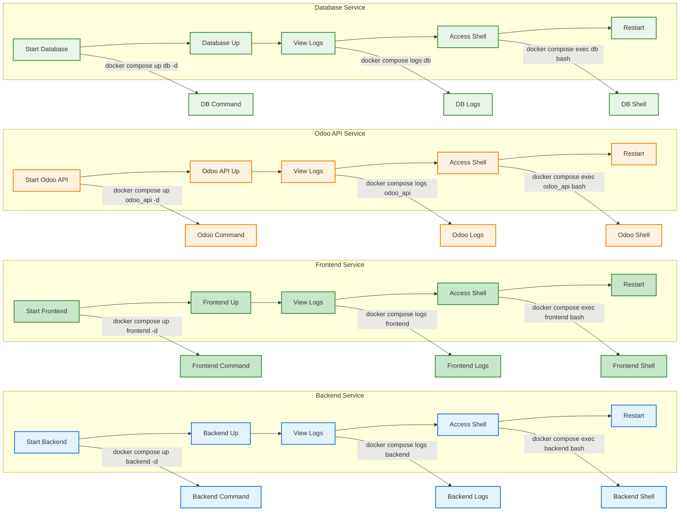
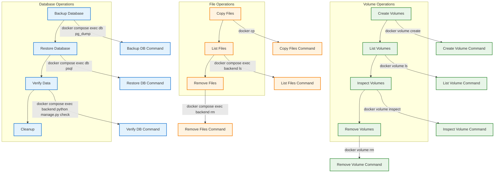

# Docker Commands and Deployment Guide

## Docker Architecture Overview

```mermaid
graph TB
    subgraph "Development Environment"
        DevCompose[Docker Compose Dev] --> DevBackend[Backend Service]
        DevCompose --> DevFrontend[Frontend Service]
        DevCompose --> DevOdoo[Odoo API Service]
        DevCompose --> DevDB[PostgreSQL Service]
    end
    
    subgraph "Production Environment"
        ProdCompose[Docker Compose Prod] --> ProdBackend[Backend Service]
        ProdCompose --> ProdFrontend[Frontend Service]
        ProdCompose --> ProdOdoo[Odoo API Service]
        ProdCompose --> ProdDB[PostgreSQL Service]
    end
    
    subgraph "Docker Images"
        BackendImage[Backend Image<br/>Python + Django + Gunicorn]
        FrontendImage[Frontend Image<br/>React + Nginx]
        OdooImage[Odoo API Image<br/>FastAPI + Gunicorn]
        DBImage[PostgreSQL Image<br/>Official]
    end
    
    subgraph "Volumes & Storage"
        DBVol[PostgreSQL Volume<br/>Persistent Data]
        StaticVol[Static Files Volume<br/>Shared Storage]
        BackupVol[Backup Volume<br/>Automated Backups]
    end
    
    subgraph "Network & Ports"
        FrontendPort[Port 80:80<br/>Frontend Nginx]
        BackendPort[Port 8000:8000<br/>Django API]
        OdooPort[Port 5000:5000<br/>Odoo API]
        DBPort[Port 5432:5432<br/>PostgreSQL]
    end
    
    %% Connections
    DevBackend --> BackendImage
    DevFrontend --> FrontendImage
    DevOdoo --> OdooImage
    DevDB --> DBImage
    
    ProdBackend --> BackendImage
    ProdFrontend --> FrontendImage
    ProdOdoo --> OdooImage
    ProdDB --> DBImage
    
    DevDB --> DBVol
    DevBackend --> StaticVol
    DevBackend --> BackupVol
    
    ProdDB --> DBVol
    ProdBackend --> StaticVol
    ProdBackend --> BackupVol
    
    DevFrontend --> FrontendPort
    DevBackend --> BackendPort
    DevOdoo --> OdooPort
    DevDB --> DBPort
    
    ProdFrontend --> FrontendPort
    ProdBackend --> BackendPort
    ProdOdoo --> OdooPort
    ProdDB --> DBPort
    
    %% Styling
    classDef dev fill:#e3f2fd,stroke:#1976d2,stroke-width:2px
    classDef prod fill:#ffebee,stroke:#d32f2f,stroke-width:2px
    classDef image fill:#f3e5f5,stroke:#7b1fa2,stroke-width:2px
    classDef volume fill:#e8f5e8,stroke:#388e3c,stroke-width:2px
    classDef port fill:#fff3e0,stroke:#f57c00,stroke-width:2px
    
    class DevCompose,DevBackend,DevFrontend,DevOdoo,DevDB dev
    class ProdCompose,ProdBackend,ProdFrontend,ProdOdoo,ProdDB prod
    class BackendImage,FrontendImage,OdooImage,DBImage image
    class DBVol,StaticVol,BackupVol volume
    class FrontendPort,BackendPort,OdooPort,DBPort port
```



## Essential Docker Commands

### Development Commands



### Production Deployment Commands



## Service Management Commands

### Individual Service Control



## Volume and Data Management



## Quick Reference Commands

### Development Environment

```bash
# Start all services
docker compose up -d

# View logs
docker compose logs -f

# Access backend shell
docker compose exec backend bash

# Run Django migrations
docker compose exec backend python manage.py migrate

# Create superuser
docker compose exec backend python manage.py createsuperuser

# View running containers
docker compose ps

# Stop all services
docker compose down

# Rebuild all images
docker compose build

# View container stats
docker compose top
```

### Production Environment

```bash
# Deploy with production configuration
docker compose -f compose.yml up -d

# Backup database
docker compose exec db pg_dump -U certificate_user certificate_db > backup.sql

# Restore database
docker compose exec -T db psql -U certificate_user -d certificate_db < backup.sql

# Monitor logs
docker compose logs -f --tail=100

# Scale services
docker compose up -d --scale backend=3

# Health check
docker compose ps

# Emergency restart
docker compose restart

# Clean up unused resources
docker system prune -f
```

### Troubleshooting Commands

```bash
# Check container health
docker compose ps

# View detailed container info
docker inspect <container_name>

# Check network connectivity
docker compose exec backend ping odoo_api

# View resource usage
docker stats

# Check disk usage
docker system df

# Remove unused images
docker image prune

# Remove unused volumes
docker volume prune