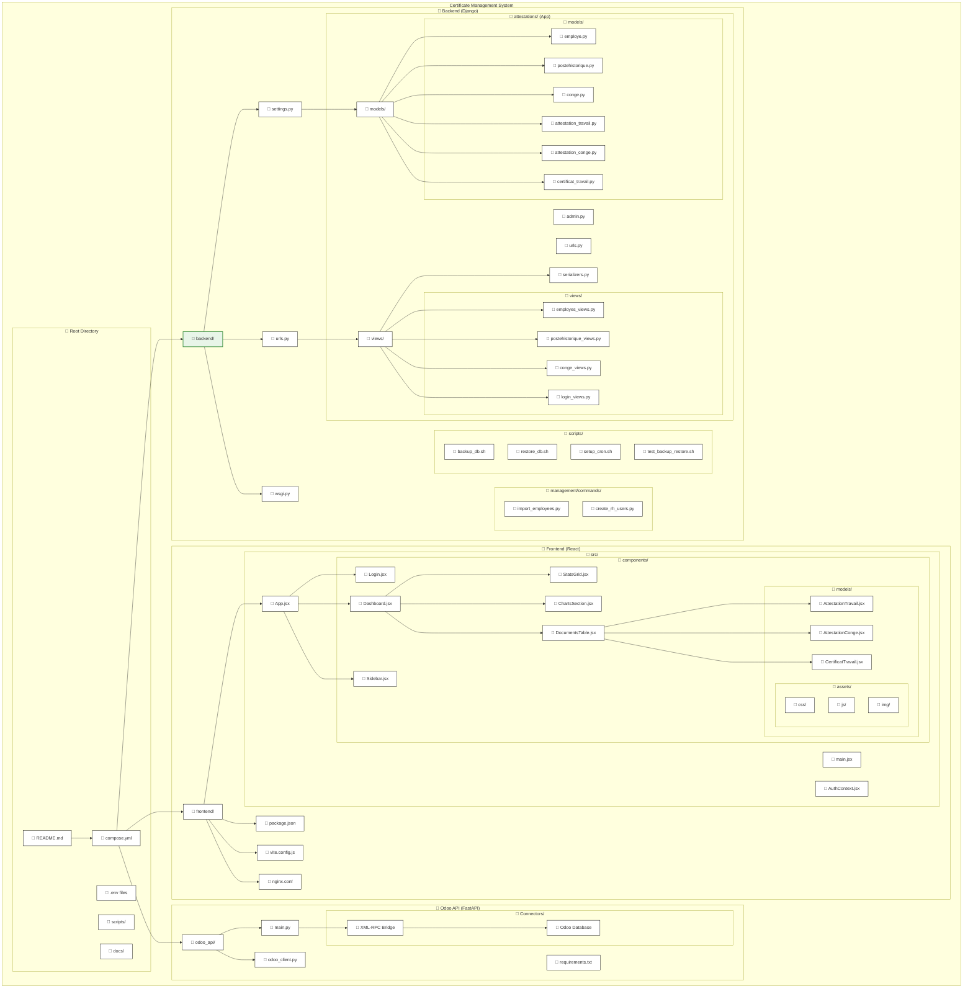
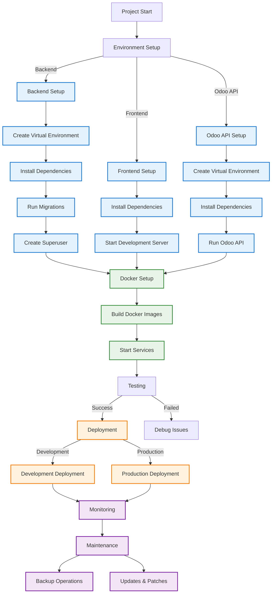
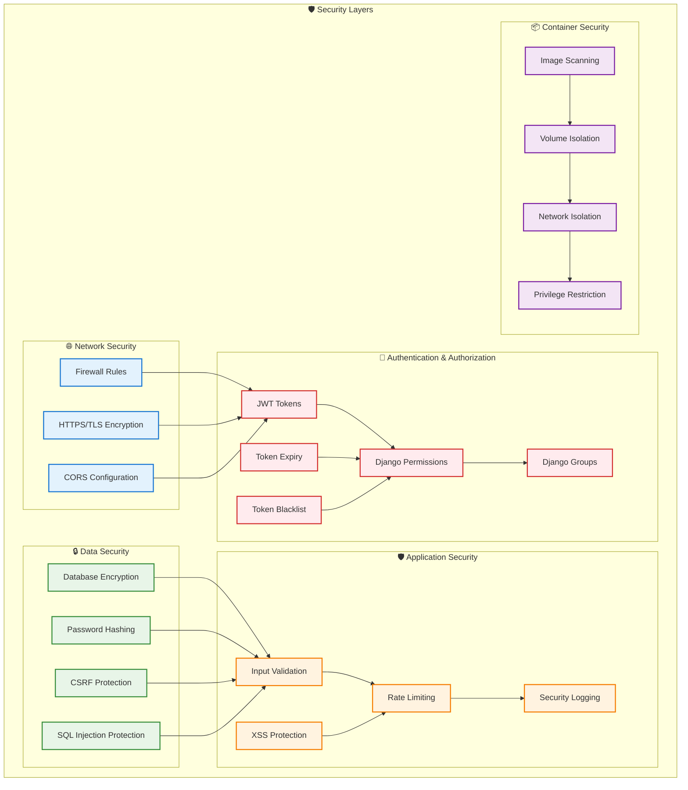

# Certificate Project - Complete Overview

## Project Structure and Organization



## Technology Stack Integration

```mermaid
graph LR
    subgraph "🌐 Frontend Layer"
        REACT[React 19]
        VITE[Vite 5]
        MANTINE[Mantine UI 8]
        TAILWIND[TailwindCSS 4]
        BUN[Bun Package Manager]
    end
    
    subgraph "🔗 Communication"
        NGINX[Nginx Reverse Proxy]
        CORS[CORS Configuration]
        JWT[JWT Authentication]
    end
    
    subgraph "⚙️ Backend Layer"
        DJANGO[Django 5.2]
        DRF[Django REST Framework 3.16]
        SIMPLEJWT[SimpleJWT]
        GUNICORN[Gunicorn WSGI]
    end
    
    subgraph "🗄️ Data Layer"
        POSTGRES[PostgreSQL 16]
        SQLITE[SQLite (Dev)]
    end
    
    subgraph "🔌 Integration Layer"
        FASTAPI[FastAPI]
        XMLRPC[XML-RPC Protocol]
        ODOO[Odoo ERP]
    end
    
    subgraph "📦 Containerization"
        DOCKER[Docker]
        COMPOSE[Docker Compose]
        VOLUMES[Volumes & Storage]
    end
    
    %% Connections
    REACT --> VITE
    VITE --> MANTINE
    MANTINE --> TAILWIND
    TAILWIND --> BUN
    
    BUN --> NGINX
    NGINX --> DJANGO
    NGINX --> FASTAPI
    CORS --> DJANGO
    JWT --> DJANGO
    
    DJANGO --> DRF
    DRF --> SIMPLEJWT
    SIMPLEJWT --> GUNICORN
    GUNICORN --> POSTGRES
    
    FASTAPI --> XMLRPC
    XMLRPC --> ODOO
    
    DOCKER --> COMPOSE
    COMPOSE --> VOLUMES
    VOLUMES --> POSTGRES
    
    %% Styling
    classDef frontend fill:#e3f2fd,stroke:#1976d2,stroke-width:2px
    classDef backend fill:#e8f5e8,stroke:#388e3c,stroke-width:2px
    classDef data fill:#fff3e0,stroke:#f57c00,stroke-width:2px
    classDef integration fill:#f3e5f5,stroke:#7b1fa2,stroke-width:2px
    classDef container fill:#e0f2f1,stroke:#00695c,stroke-width:2px
    
    class REACT,VITE,MANTINE,TAILWIND,BUN,NGINX,CORS,JWT frontend
    class DJANGO,DRF,SIMPLEJWT,GUNICORN backend
    class POSTGRES,SQLITE data
    class FASTAPI,XMLRPC,ODOO integration
    class DOCKER,COMPOSE,VOLUMES container
```

## Development Workflow



## API Endpoints Map

```mermaid
graph TB
    subgraph "🔐 Authentication"
        LOGIN[POST /api/login/]
        LOGOUT[POST /api/logout/]
        REFRESH[POST /api/refresh/]
        VERIFY[POST /api/token/verify/]
        ME[GET /api/me/]
        SIGNUP[POST /api/attestations/signup/]
    end
    
    subgraph "👥 Employee Management"
        EMP_LIST[GET /api/attestations/employes/]
        EMP_CREATE[POST /api/attestations/employes/]
        EMP_DETAIL[GET /api/attestations/employes/{id}/]
        EMP_UPDATE[PUT /api/attestations/employes/{id}/]
        EMP_DELETE[DELETE /api/attestations/employes/{id}/]
    end
    
    subgraph "📋 Post History"
        POSTE_LIST[GET /api/attestations/postes/]
        POSTE_CREATE[POST /api/attestations/postes/]
        POSTE_DETAIL[GET /api/attestations/postes/{id}/]
        POSTE_UPDATE[PUT /api/attestations/postes/{id}/]
        POSTE_DELETE[DELETE /api/attestations/postes/{id}/]
    end
    
    subgraph "🏖️ Leave Management"
        CONGE_LIST[GET /api/attestations/conges/]
        CONGE_CREATE[POST /api/attestations/conges/]
        CONGE_DETAIL[GET /api/attestations/conges/{id}/]
        CONGE_UPDATE[PUT /api/attestations/conges/{id}/]
        CONGE_DELETE[DELETE /api/attestations/conges/{id}/]
    end
    
    subgraph "📄 Document Generation"
        ATTEST_TRAVAIL[GET/POST /api/attestations/attestation-travail/]
        ATTEST_CONGE[GET/POST /api/attestations/attestation-conge/]
        CERTIF_TRAVAIL[GET/POST /api/attestations/certificat-travail/]
    end
    
    subgraph "🔗 Odoo Integration"
        ODOO_PARTNERS[GET /partners]
        ODOO_EMPLOYEES[GET /employees]
        ODOO_EMP_DETAIL[GET /employees/{id}]
        ODOO_SEARCH[GET /employees/search?name=&number=]
    end
    
    %% Connections
    LOGIN --> EMP_LIST
    ME --> EMP_LIST
    SIGNUP --> EMP_LIST
    
    EMP_LIST --> POSTE_LIST
    EMP_LIST --> CONGE_LIST
    EMP_LIST --> ATTEST_TRAVAIL
    EMP_LIST --> ATTEST_CONGE
    EMP_LIST --> CERTIF_TRAVAIL
    
    POSTE_LIST --> ATTEST_TRAVAIL
    CONGE_LIST --> ATTEST_CONGE
    
    ODOO_EMPLOYEES --> EMP_LIST
    ODOO_SEARCH --> EMP_LIST
    
    %% Styling
    classDef auth fill:#ffebee,stroke:#d32f2f,stroke-width:2px
    classDef employee fill:#e8f5e8,stroke:#388e3c,stroke-width:2px
    classDef document fill:#fff3e0,stroke:#f57c00,stroke-width:2px
    classDef integration fill:#f3e5f5,stroke:#7b1fa2,stroke-width:2px
    
    class LOGIN,LOGOUT,REFRESH,VERIFY,ME,SIGNUP auth
    class EMP_LIST,EMP_CREATE,EMP_DETAIL,EMP_UPDATE,EMP_DELETE,POSTE_LIST,POSTE_CREATE,POSTE_DETAIL,POSTE_UPDATE,POSTE_DELETE employee
    class CONGE_LIST,CONGE_CREATE,CONGE_DETAIL,CONGE_UPDATE,CONGE_DELETE document
    class ATTEST_TRAVAIL,ATTEST_CONGE,CERTIF_TRAVAIL integration
    class ODOO_PARTNERS,ODOO_EMPLOYEES,ODOO_EMP_DETAIL,ODOO_SEARCH integration
```

## Security Architecture



## Key Features Summary

### 📋 Document Types
- **Attestation de Travail** - Proof of current employment
- **Attestation de Conge** - Leave confirmation document  
- **Certificat de Travail** - Employment termination certificate

### 🔗 Integration Features
- **Odoo ERP Synchronization** - Real-time employee data sync
- **XML-RPC Protocol** - Secure communication with Odoo
- **Automated Data Import** - CSV import functionality

### 🛡️ Security Features
- **JWT Authentication** - Secure token-based auth
- **Role-based Access** - Admin, RH User, and Viewer roles
- **CORS Protection** - Cross-origin request security
- **Database Security** - Encrypted connections and data

### 🐳 Deployment Features
- **Docker Containerization** - Multi-service architecture
- **Automated Backups** - 10-minute interval database backups
- **Health Monitoring** - Service health checks
- **Volume Persistence** - Data persistence across restarts

### 🎨 User Interface
- **Modern React SPA** - Responsive single-page application
- **Mantine UI Components** - Professional component library
- **TailwindCSS Styling** - Utility-first CSS framework
- **Real-time Updates** - Live data synchronization

This comprehensive overview provides a complete picture of the Certificate Management System architecture, technology stack, and key features.