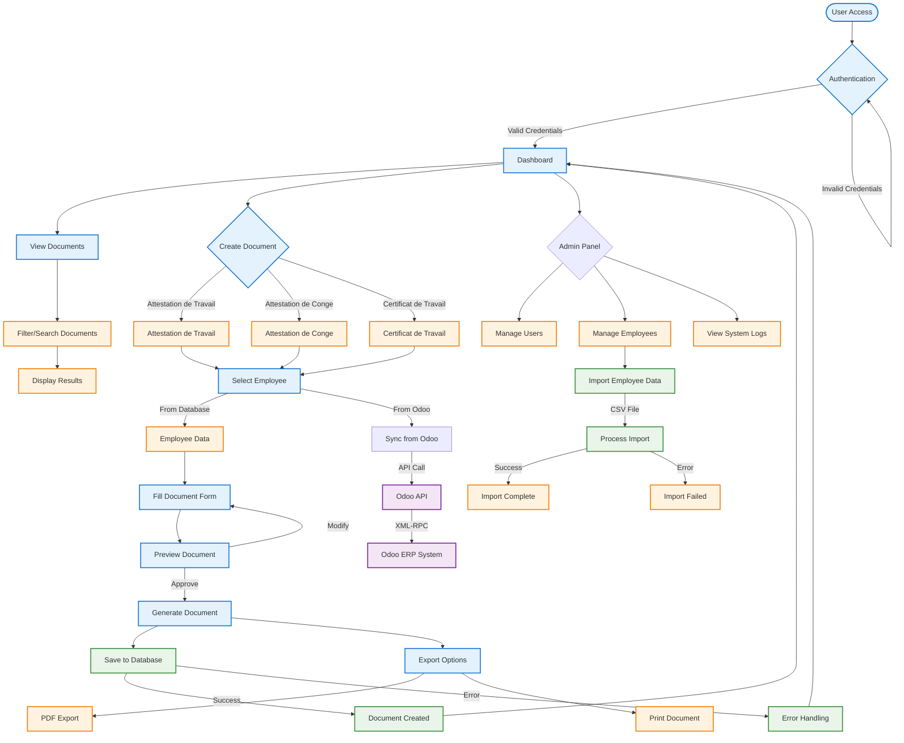
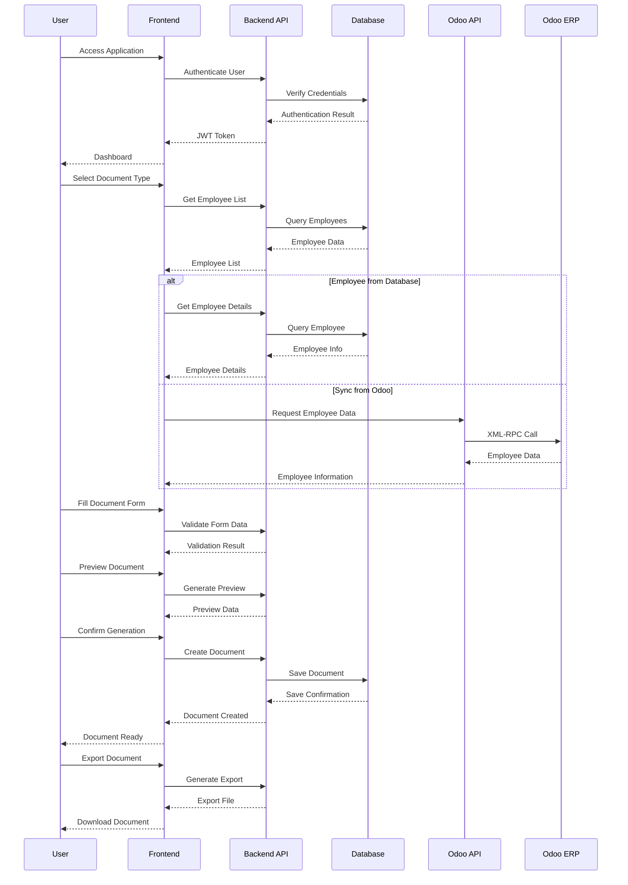
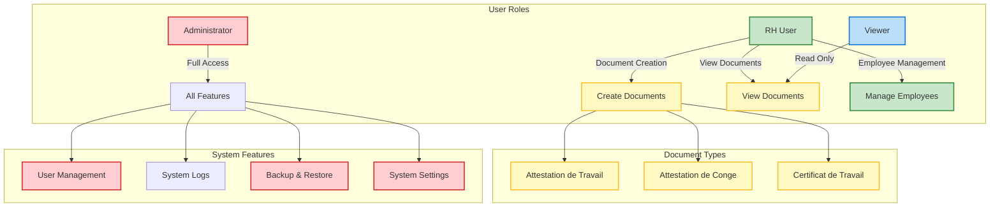

# Certificate System Usage Flow

## User Interaction Diagram

## Document Creation Flow

## User Roles and Permissions

## Key User Journeys

### 1. New Employee Onboarding
1. Admin imports employee data from CSV or syncs from Odoo
2. System validates and stores employee information
3. Employee becomes available for document creation

### 2. Document Generation
1. User logs in and accesses dashboard
2. Selects document type (Attestation de Travail/Conge/Certificat)
3. Chooses employee (from database or syncs from Odoo)
4. Fills required information
5. Previews document
6. Generates and exports document

### 3. Document Management
1. User views existing documents
2. Filters/searches by criteria (employee, date, type)
3. Views document details
4. Downloads or prints documents

### 4. System Administration
1. Admin manages user accounts and permissions
2. Monitors system logs
3. Performs backup and restore operations
4. Configures system settings